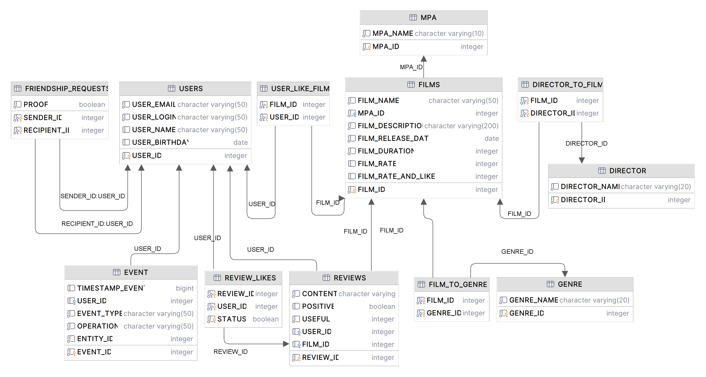

# java-filmorate

Template repository for Filmorate project.


- **USERS** - основная информация по пользователю
- **FRIENDSHIP_REQUESTS** - запросы в друзья
- **FILMS** - основная информация по фильмам
- **USER_LIKE_FILM** - понравившиеся фильмы пользователю
- **GENRE** - список жанров
- **FILM_TO_GENRE** - жанры фильмов
- **MPA** - рейтинг Ассоциации кинокомпаний и описание
- **DIRECTOR** - список режиссеров
- **DIRECTOR_TO_FILM** - режиссеры фильмов
- **REVIEWS** - отзывы пользователей
- **REVIEW_LIKES** - рейтинг отзывов
- **EVENT** - лента событий пользователя

Пример:

```sql
SELECT u.Name,
       f.Name
FROM Users AS u
         LEFT OUTER JOIN UsersMovieLibrary AS mv
                         ON mv.FilmID = u.UserID
         LEFT OUTER JOIN Films AS f
                         ON f.FilmID = mv.FilmID
WHERE u.UserID = 'ID user'
```

### Технологический стек

#### Языки программирования

- JAVA

#### Используемый Framework's

- Spring Boot

#### Система сборки

- Maven

#### База данных

- H2 SQL

### Архитектура

- REST API

____

##### Состав команды разработки

- Бегимова Гаухар
- Бузмаков Виктор
- Телейчук Игорь
- Шестаков Артём
- Ябров Николай 